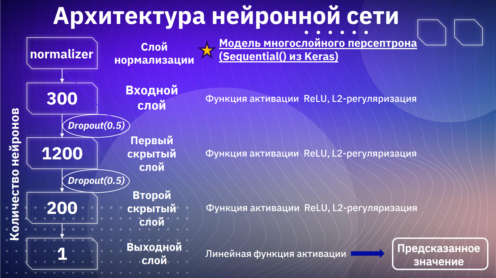

# 💻 Предсказание цен ноутбуков по их характеристикам

Проект на Python для анализа и машинного обучения: предсказываем рыночную цену ноутбуков на основе их технических характеристик.

---

## 📋 Содержание

- [Описание проекта](./report.pdf)  
- [Данные](./laptop-price.csv)
- 
- 

---

## Описание проекта

В этом проекте мы:

1. Собираем и очищаем датасет с характеристиками ноутбуков (процессор, RAM, SSD, экран, GPU и т. д.).  
2. Проводим разведочный анализ данных (EDA) и визуализируем зависимости.  
3. Обучаем несколько моделей регрессии для предсказания цены: линейная регрессия, случайный лес, градиентный бустинг.  
4. Подбираем гиперпараметры с помощью `GridSearchCV`.  
5. Оцениваем качество моделей метриками MAE, RMSE и R².  
6. Сравниваем модели и сохраняем лучшую для дальнейшего использования.

---

## Данные

- Источник: открытый датасет с Kaggle / собственный сбор.  
- Формат: CSV, колонки включают:
  - `Brand` — производитель  
  - `Model` — модель  
  - `Processor` — CPU  
  - `RAM` — объем оперативной памяти (ГБ)  
  - `Storage` — объем и тип накопителя (SSD/HDD)  
  - `ScreenSize` — диагональ экрана (дюймы)  
  - `GPU` — видеокарта  
  - `Price` — цена (целевая переменная)  

